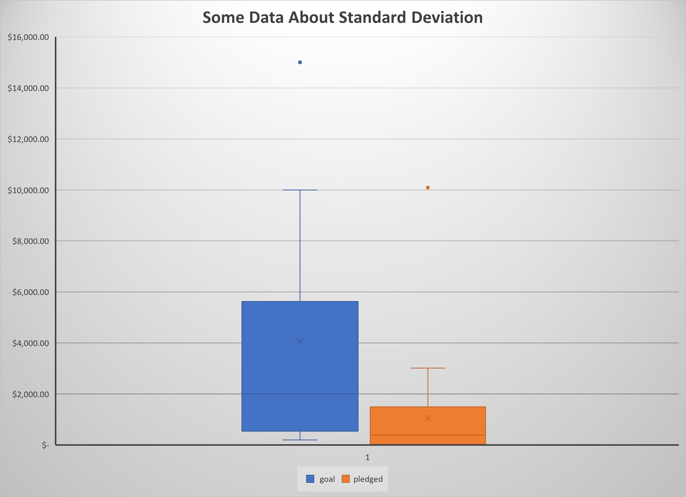
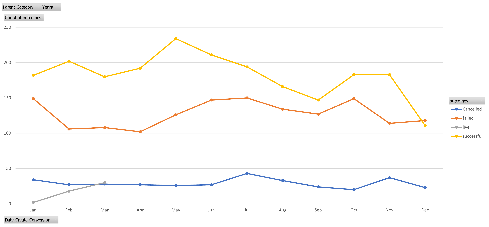
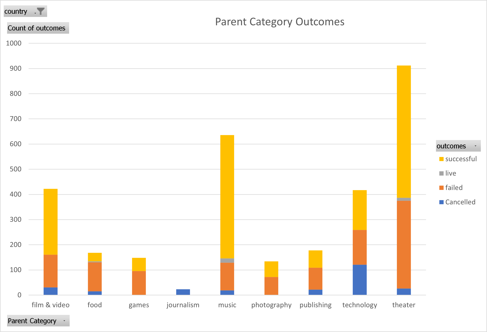

# An Analysis of Kickstarter Campaigns.

Statistical analysis of fictional data for a fictional person.  Louise, really, who has a name like Louise, you must be a bot or something.  Inside you will find arbitrary findings to data which may or may not have been manufactured for demonstrational purposes.

---
## Exciting Insights

* Interesting Finding
* Wow, Look at this one
* She did this one thing to start her play, and theatres hate her for it.

---

## Some images to demonstrate said findings.

---
## All the data where the findings were found.

[AllTheData](data-1-1-3-StarterBook.xlsx)

---
## Recommendations.

Our recommendations are recommendations, and we do highly suggest that you follow them.  However as they are just recommendations, you may do with them as you wish, as we recieved our compensation either way. Thank you for your business.
