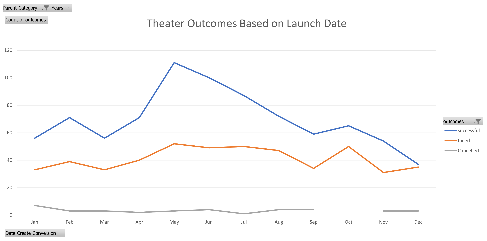
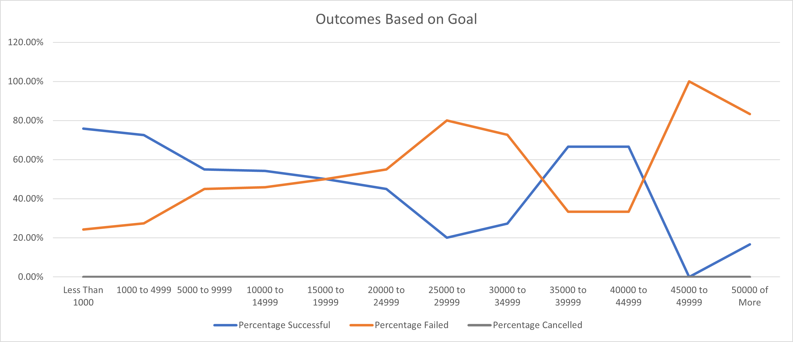

# Kickstarting with Excel

## Overview of Project

### Purpose

Statistical analysis of fictional data for a fictional person. Louise, really, who has a name like Louise, you must be a bot or something. Inside you will find arbitrary findings to data which may or may not have been manufactured for demonstrational purposes.  Below, you can see some examples of what points are being expressed.  They are really good points, you should look at them extra hard.

* Point 1
* Another Good Point
* Holy Moly, Would you look at this fantastic point.
* Hard Point
* Hard Point 2 : Break Point
* Hard Point 3 : Return of the Point
* Hard Point 4 : Point Harder

## Analysis and Challenges

### Analysis of Outcomes Based on Launch Date

Janurary with that Christmas money, people are looking to spend and interest in just giving to fledgling ventures rises and the number of success sees an uptick.  This fluctuates a bit through as in Februrary every man realizes he spent it all on valentines, which must be too much, cause it causes a low point in March.  March to April finances have recovered, and once everyone is obsessed with miracles cause Easter, there is a rise of biblical proportions that peaks in May and begins taper off through September.  There is a decline through Christmas that can only be atrributed to spending going towards the final fiscal quarter of retail and everybody needing to needlessly decorate their dwellings with seasonal fare, resulting in no one having money to spend on frivolous activities like plays.

### Analysis of Outcomes Based on Goals

It appears that everyone likes a very cheap play (80% success at <$1k) and some people like very expensive plays(20% success at >$50k), with a decent chunk liking semi expensive plays (70% success between $30k and $45k), and no one wanting a play that cost alot but looks cheap cause they didnt spend enough (80% failure between $25k and $35k).

### Challenges and Difficulties Encountered

When setting up your tables, you really should be mindful of what variables you want to use, and whether or not you've narrowed your scope in the way that you planned.  Pointing your formulas to the wrong cells can be a pain to track down when the formulae get be long with nested statements.  I surely didnt do this, theres no way that I did this, im saying that you should be mindful of it because this very much did not happen to me while i was building this report, im just saying that you should, not me.

## Results

- What are two conclusions you can draw about the Outcomes based on Launch Date?
 The analysis of outcomes based on launch date show that While the early summer is where it's at, you really can't go wrong with anything but Halloween, Thanksgiving and Christmas.  People love their three Ps: pumpkins, pie, and presents.  
 
- What can you conclude about the Outcomes based on Goals?
 The analysis of Goals show that the sweet spot of cash to beg for is is <5k and between 35k and 45k.  Surprisingly, it seems with the "right stuff" you could swindle some people out of 50k or more.  Maybe that one needs some further analysis.

- What are some limitations of this dataset?
 While this dataset goes into some detail and possibly enough to make a general decision, more data could be gathered.  How do the costumes look? the set? were donuts provided to the cast?  what rewards were backers givin?  free plushies? wands made of oak with pheonix feather cores? how about drinks and dinner?  were the trains all on time during the campaign? was this promised to backers? there are so many more questions to ask, i feel this is only a start.  
- What are some other possible tables and/or graphs that we could create?
 Letter count in title/blurb vs success/fail.  Staff Pick vs failures, does it being a staff pick lead to a worse outcome, I MUST KNOW!
